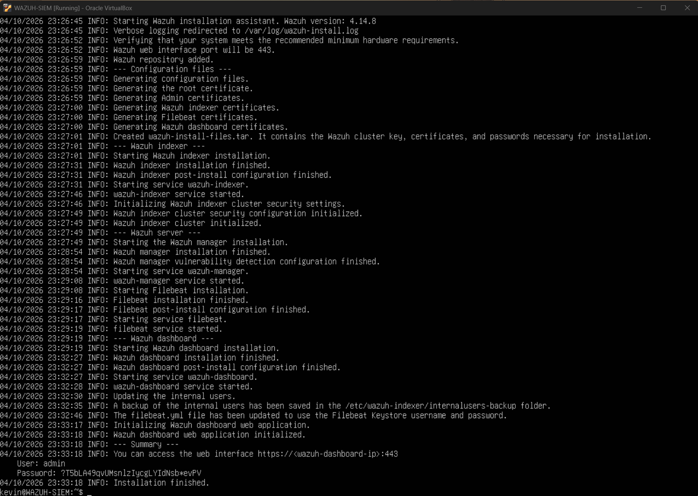
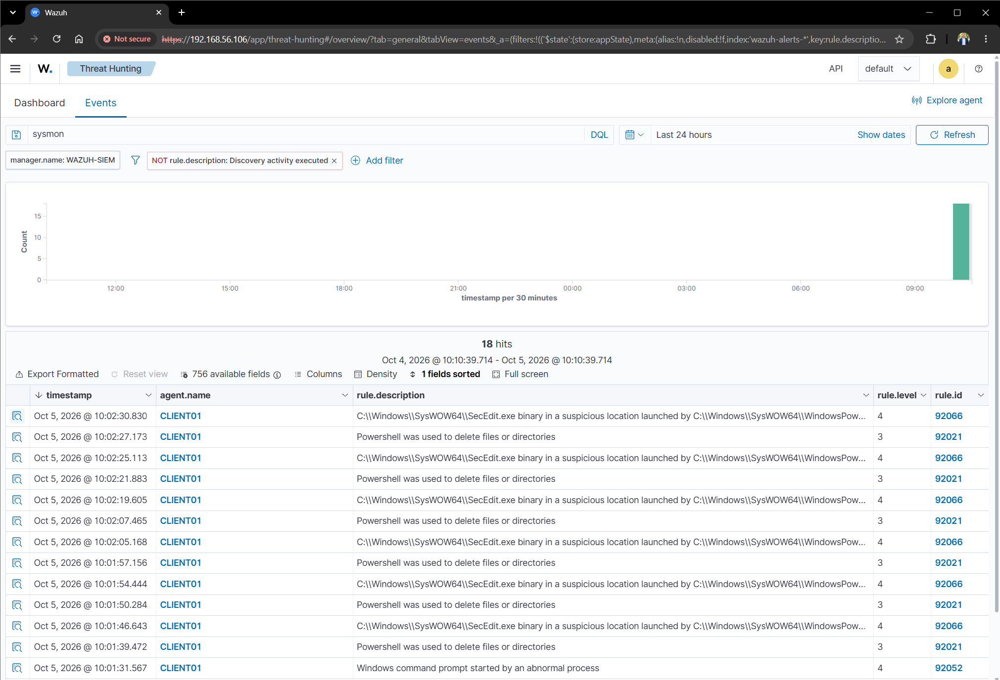
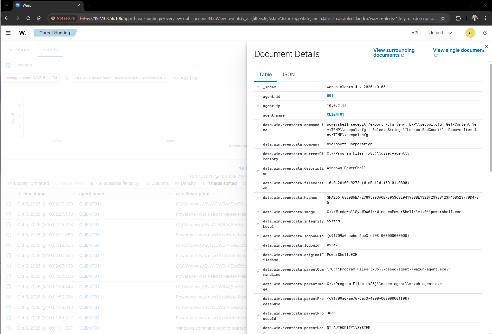
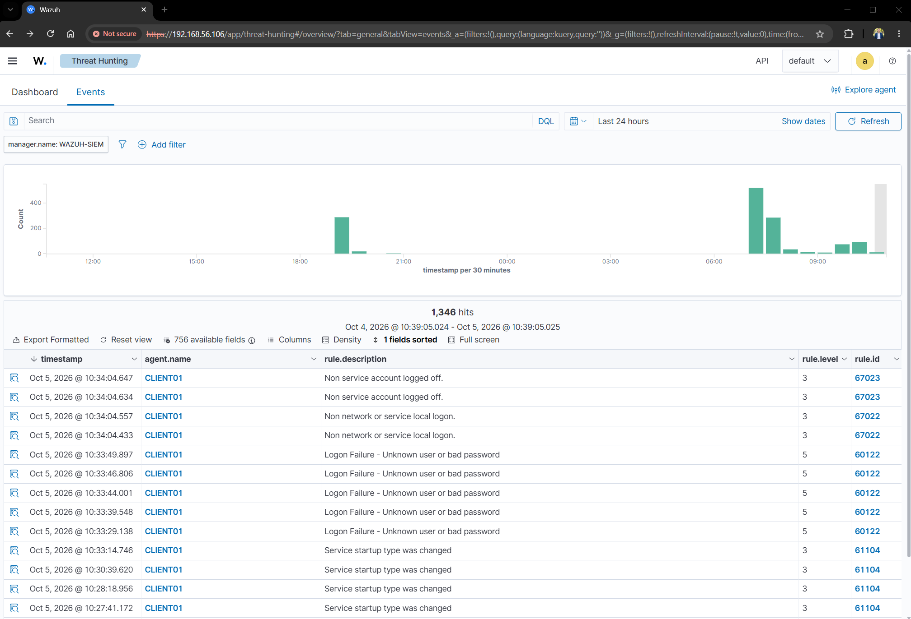
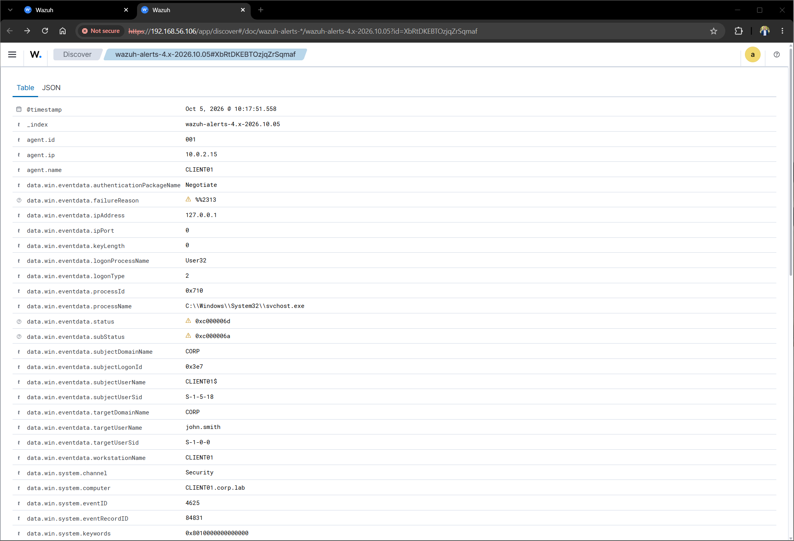
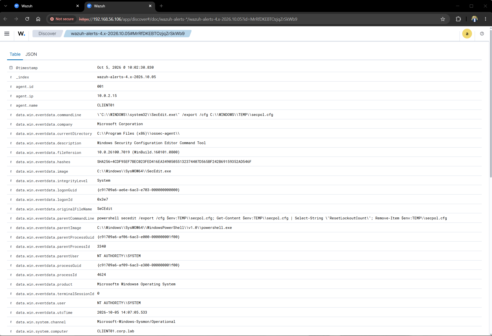
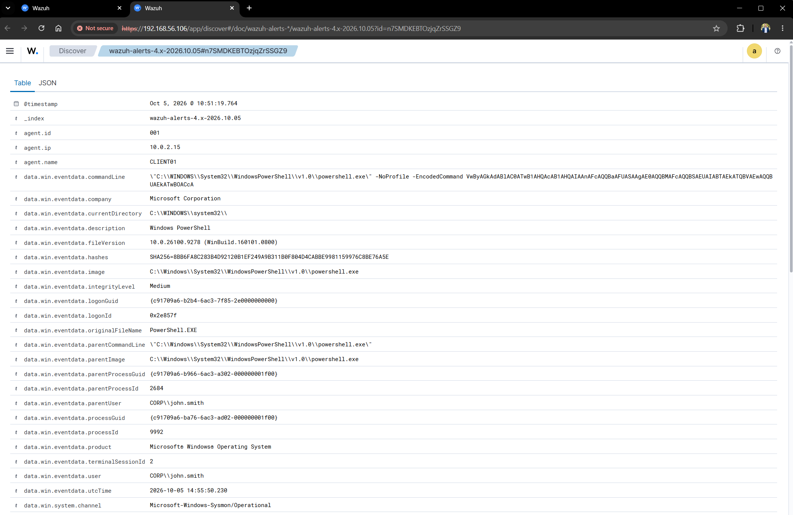
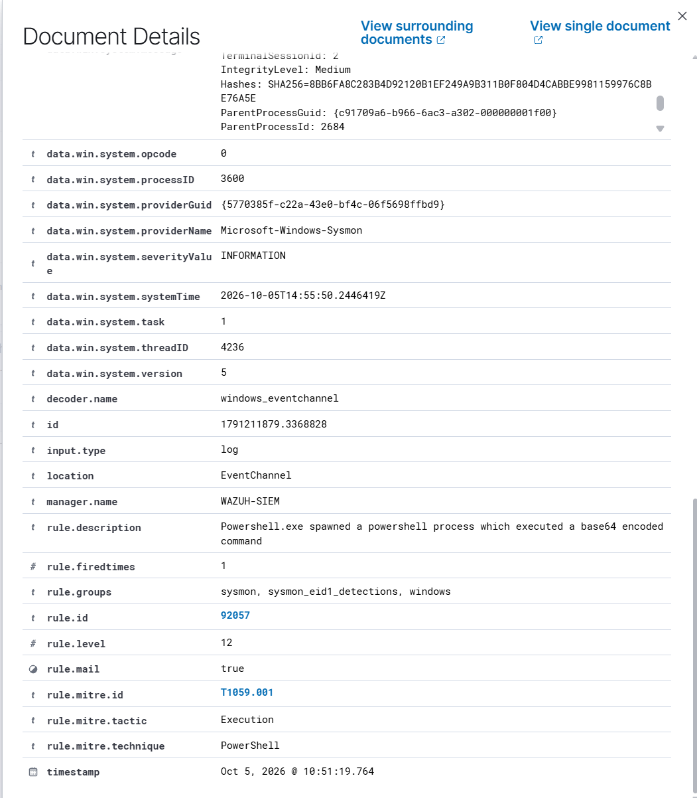

# SOC & SIEM Monitoring Lab

## Overview

In this project I built a hands on Security Operations Center (SOC) and Security Information and Event Management (SIEM) lab using Wazuh, Sysmon, Windows Security logs, and MITRE ATT&CK.

The lab builds on an Active Directory environment and demonstrates how endpoint telemetry is collected, analyzed, detected, and investigated from a centralized security monitoring platform.

The goal was to gain practical experience with endpoint monitoring, security event analysis, threat detection, and incident investigation.

## Objectives

- Deploy and configure Wazuh as a centralized SIEM platform
- Connect a Windows 11 endpoint to Wazuh
- Collect Windows Security and Sysmon telemetry
- Monitor authentication and account activity
- Detect suspicious PowerShell behavior
- Investigate security alerts and endpoint events
- Map detections to MITRE ATT&CK techniques
- Practice a basic SOC investigation workflow

## Lab Environment

| Component | Configuration |
|---|---|
| SIEM | Wazuh 4.14.8 |
| SIEM Server | Ubuntu Server 24.04 LTS |
| Endpoint | Windows 11 Pro |
| Endpoint Name | CLIENT01 |
| Domain | corp.lab |
| Domain Controller | AD-DC01 |
| Network | VirtualBox NAT + Host-Only |
| Monitoring Agent | Wazuh Agent |
| Endpoint Telemetry | Sysmon + Windows Security Logs |

## Architecture

```text
                 ┌──────────────────────────┐
                 │      Windows 11 Host     │
                 │        VirtualBox        │
                 └────────────┬─────────────┘
                              │
                 ┌────────────┴─────────────┐
                 │                          │
        ┌────────▼────────┐       ┌────────▼────────┐
        │    CLIENT01     │       │   WAZUH-SIEM    │
        │   Windows 11    │       │ Ubuntu Server   │
        │                 │       │                 │
        │ Windows Logs    │       │ Wazuh Manager   │
        │ Sysmon          │──────▶│ Wazuh Indexer   │
        │ Wazuh Agent     │       │ Wazuh Dashboard │
        └─────────────────┘       └─────────────────┘
                 │
                 │
        ┌────────▼────────┐
        │    AD-DC01      │
        │ Windows Server   │
        │ Active Directory │
        │ DNS              │
        └──────────────────┘

```

# Step-by-Step Lab Documentation

This section documents the major configuration, monitoring, detection, and investigation steps performed during the project.


## 1. Wazuh Installation

I deployed Wazuh on a dedicated Ubuntu Server 24.04 LTS virtual machine.

The Wazuh deployment provides the centralized SIEM infrastructure used throughout the project. The installation includes the Wazuh Manager, Wazuh Indexer, and Wazuh Dashboard.

The Wazuh server was configured with access to both the Internet through NAT and the isolated cybersecurity lab through a Host Only network.



---

## 2. Wazuh Dashboard

After installation, I accessed the Wazuh Dashboard from the Windows host.

The dashboard provides the primary interface used to review security events, investigate alerts, search endpoint telemetry, and perform threat hunting.

This confirmed that the Wazuh services were successfully installed and that the Dashboard was accessible from the lab environment.


---

## 3. Wazuh Agent Connected

I installed and registered the Wazuh Agent on CLIENT01, the Windows 11 workstation used as the monitored endpoint.

The Wazuh Agent collects security telemetry from the endpoint and forwards it to the Wazuh Manager.

After registration, CLIENT01 appeared in the Wazuh Dashboard with an **Active** status.

This verified that communication between the Windows endpoint and the SIEM was working.


---

## 4. Sysmon Events

I enabled Sysmon on CLIENT01 to provide additional endpoint telemetry.

Windows Security logs provide useful authentication and account-management information, but Sysmon provides additional visibility into process execution and other endpoint activity.

I verified that Sysmon was generating events through the Windows Sysmon Operational log.

These events provide additional context that can be useful during a security investigation.


---

## 5. Wazuh Threat Hunting

Once endpoint telemetry was being collected, I used the Wazuh Dashboard to search through security events.

Threat hunting allows an analyst to proactively search available telemetry for activity that may require additional investigation instead of relying only on automatically generated alerts.

I reviewed events generated by CLIENT01 and looked for authentication, process, PowerShell, and account-related activity.



---

## 6. Sysmon Event Investigation

I investigated individual Sysmon events through Wazuh to understand the amount of endpoint information available to an analyst.

Sysmon can provide information about processes and other endpoint activity that may not be available from basic Windows Security events alone.

During an investigation, information such as the process involved, command-line information, user context, and timestamps can help determine what occurred on the endpoint.



---

## 7. Failed Logon Detection

I performed a controlled failed authentication attempt against CLIENT01 to demonstrate Windows authentication monitoring.

Windows generated a failed logon security event, which was collected by the Wazuh Agent and processed by the Wazuh Manager.

Wazuh generated an alert that could then be investigated through the Dashboard.

This demonstrated the complete monitoring process:

**Failed Login → Windows Security Event → Wazuh Agent → Wazuh Manager → Wazuh Alert → Analyst Investigation**


---

## 8. Multiple Failed Logins

I generated multiple controlled failed authentication attempts to examine how repeated authentication failures appear in the SIEM.

A single failed login can be caused by something as simple as a user entering an incorrect password.

However, repeated authentication failures can potentially indicate password guessing, brute-force activity, credential misuse, or automated authentication attempts.

The activity must therefore be investigated in context rather than automatically classified as malicious.



---

## 9. Failed Login Investigation

After detecting the failed authentication activity, I investigated the event through the Wazuh Dashboard.

I reviewed information such as the affected account, endpoint, timestamp, and authentication details.

This demonstrates the difference between simply receiving an alert and actually investigating the underlying security event.

A SOC analyst needs to determine what happened, which account was involved, which system was affected, and whether the activity was expected.


---

## 10. Windows Event ID 4625

The failed authentication investigation identified Windows Security Event ID **4625**.

Event ID 4625 represents a failed logon attempt.

Reviewing the underlying Windows event provides additional information that can help an analyst understand the authentication failure and correlate it with other activity.

This demonstrates how Wazuh can centralize Windows Security events and make them available for investigation through the SIEM.



---

## 11. Sysmon Alert Investigation

I continued the investigation by reviewing Sysmon-related information associated with endpoint activity.

The purpose was to understand how endpoint telemetry can provide additional context beyond the initial security alert.

Process-level information can help an analyst determine which application or process was responsible for activity and what other information may be relevant to the investigation.



---

## 12. Encoded PowerShell Detection

PowerShell is a legitimate Windows administration tool, but it is also frequently used during attacks because it provides extensive capabilities for executing commands and scripts.

I investigated encoded PowerShell activity in the lab to understand how this type of behavior appears in a SIEM.

Encoded PowerShell commands can make the contents of a command less immediately visible to an analyst.

Wazuh detected the activity and generated an alert that could be investigated through the Dashboard.


---

## 13. Encoded PowerShell Investigation

After the encoded PowerShell alert was generated, I investigated the associated endpoint telemetry.

The investigation focused on the available process and command-line information to understand what occurred on CLIENT01.

This demonstrates an important SOC principle:

**An alert is the beginning of an investigation, not the conclusion.**

The analyst needs to review the available evidence and determine whether the activity is expected, suspicious, or potentially malicious.



---

## 14. MITRE ATT&CK Mapping

I used the MITRE ATT&CK framework to provide additional context for the PowerShell activity observed during the investigation.

PowerShell execution can be mapped to:

**T1059.001 – PowerShell**

Encoded or obfuscated command activity can also be associated with:

**T1027 – Obfuscated/Compressed Files and Information**

Mapping observed behavior to MITRE ATT&CK helps connect individual security events to known adversary techniques and provides a standardized way to describe attacker behavior.




## Project Outcome

This project provided hands on experience building and operating a small SOC style monitoring environment.

I configured centralized security monitoring with Wazuh, connected a Windows endpoint, collected Windows and Sysmon telemetry, investigated authentication activity, analyzed PowerShell behavior, and mapped observed activity to the MITRE ATT&CK framework.

The project demonstrates the complete workflow of:

**Endpoint Activity → Security Telemetry → SIEM Collection → Detection → Investigation → Analysis**

This lab builds on my previous **Active Directory & Windows Security Lab** and serves as the foundation for future cybersecurity projects focused on identity management, vulnerability management, and security operations.

---

