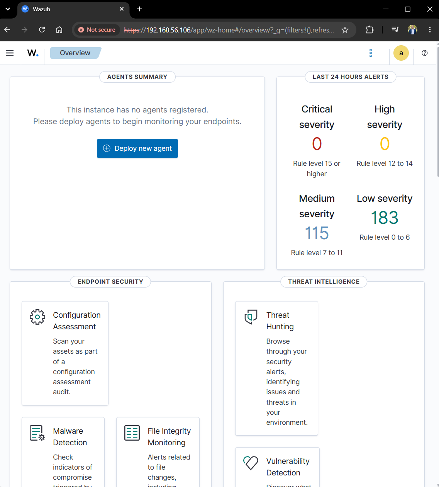
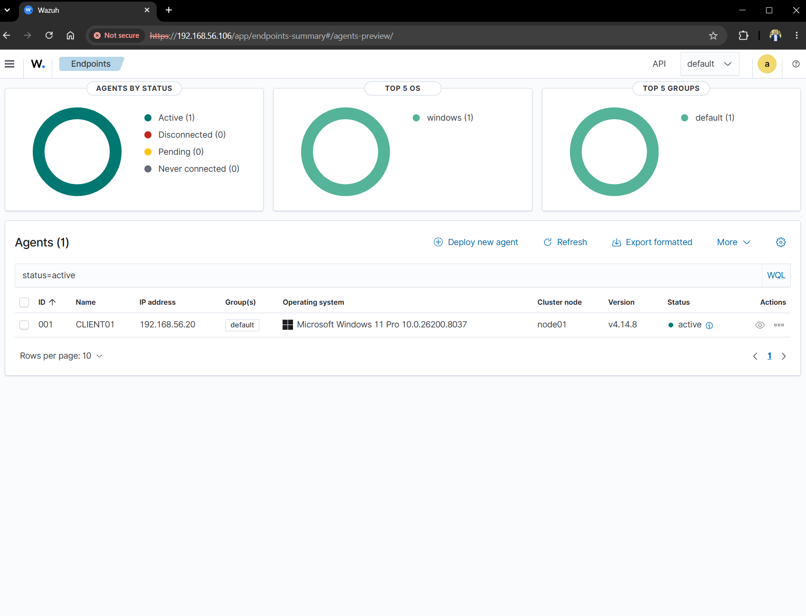
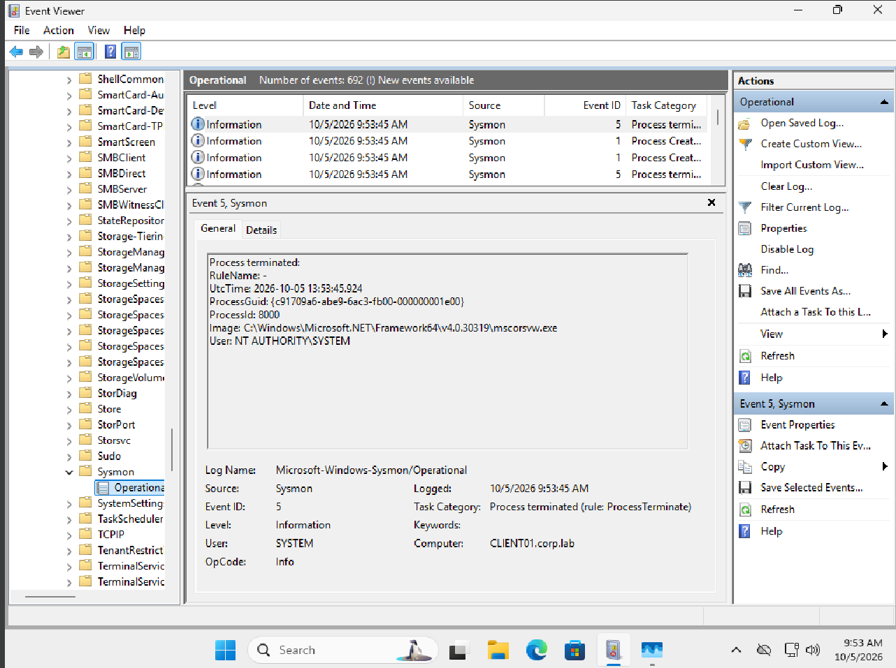
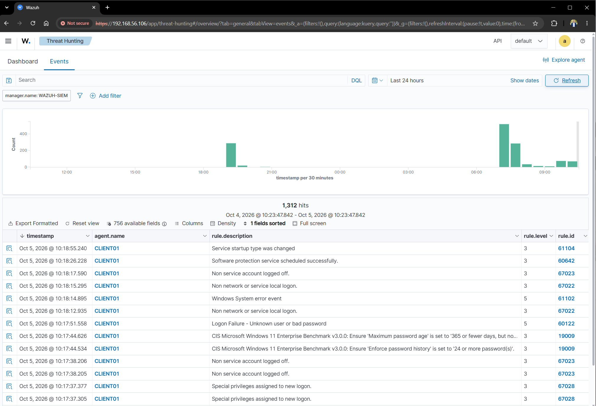
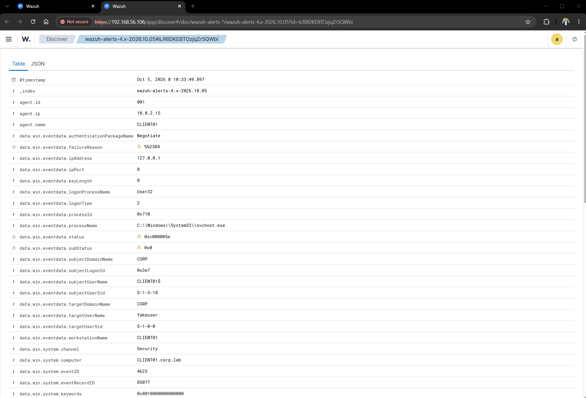
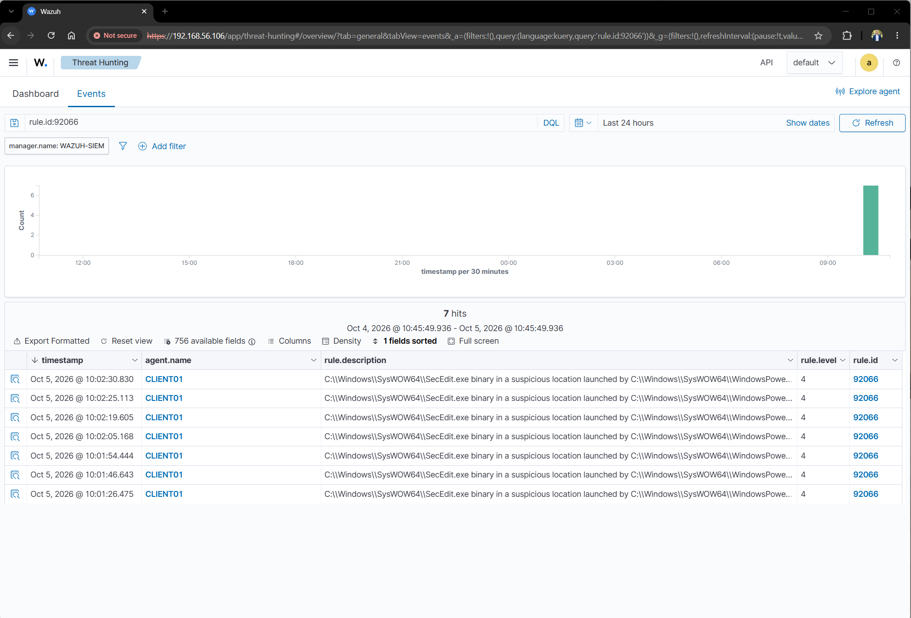
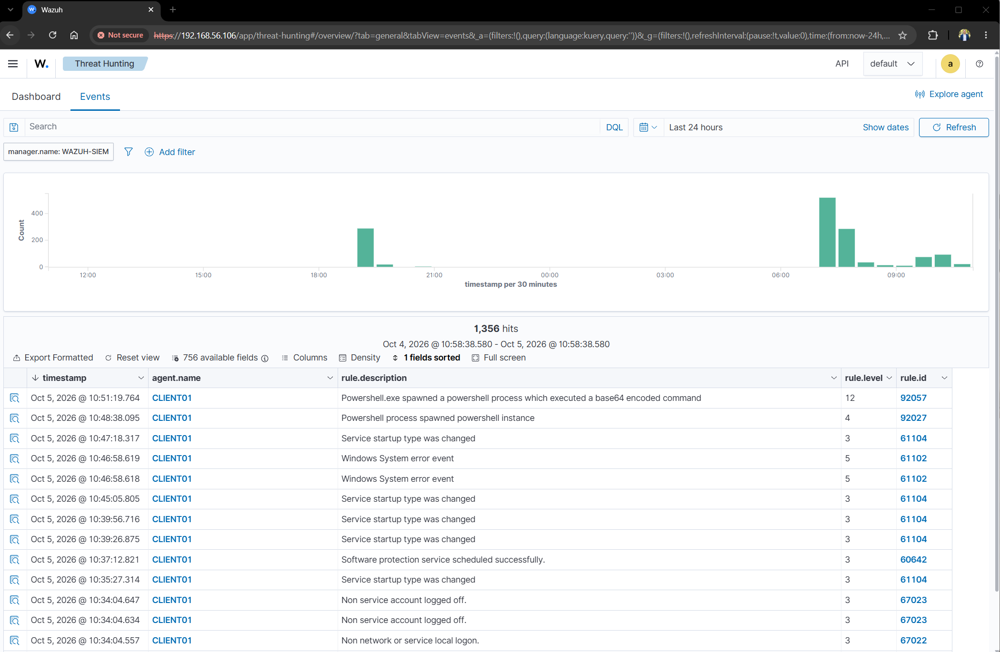
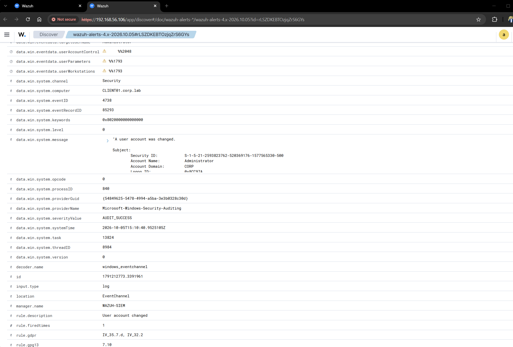

# SOC & SIEM Monitoring Lab

## Overview

This project builds a hands on Security Operations Center (SOC) and Security Information and Event Management (SIEM) lab using Wazuh, Sysmon, Windows Security logs, and MITRE ATT&CK.

The lab builds on an Active Directory environment and demonstrates how endpoint telemetry is collected, analyzed, detected, and investigated from a centralized security monitoring platform.

The goal was to gain practical experience with endpoint monitoring, security event analysis, threat detection, and incident investigation.

## Objectives

- Deploy and configure Wazuh as a centralized SIEM platform
- Connect a Windows 11 endpoint to Wazuh
- Collect Windows Security and Sysmon telemetry
- Monitor authentication and account activity
- Detect suspicious PowerShell behavior
- Investigate security alerts and endpoint events
- Map detections to MITRE ATT&CK techniques
- Practice a basic SOC investigation workflow

## Lab Environment

| Component | Configuration |
|---|---|
| SIEM | Wazuh 4.14.8 |
| SIEM Server | Ubuntu Server 24.04 LTS |
| Endpoint | Windows 11 Pro |
| Endpoint Name | CLIENT01 |
| Domain | corp.lab |
| Domain Controller | AD-DC01 |
| Network | VirtualBox NAT + Host-Only |
| Monitoring Agent | Wazuh Agent |
| Endpoint Telemetry | Sysmon + Windows Security Logs |

## Architecture

```text
                 ┌──────────────────────────┐
                 │      Windows 11 Host     │
                 │        VirtualBox        │
                 └────────────┬─────────────┘
                              │
                 ┌────────────┴─────────────┐
                 │                          │
        ┌────────▼────────┐       ┌────────▼────────┐
        │    CLIENT01     │       │   WAZUH-SIEM    │
        │   Windows 11    │       │ Ubuntu Server   │
        │                 │       │                 │
        │ Windows Logs    │       │ Wazuh Manager   │
        │ Sysmon          │──────▶│ Wazuh Indexer   │
        │ Wazuh Agent     │       │ Wazuh Dashboard │
        └─────────────────┘       └─────────────────┘
                 │
                 │
        ┌────────▼────────┐
        │    AD-DC01      │
        │ Windows Server   │
        │ Active Directory │
        │ DNS              │
        └──────────────────┘

```

## Screenshots

### Wazuh Dashboard


### Wazuh Agent Connected


### Sysmon Endpoint Telemetry


### Failed Logon Detection


### Failed Login Investigation


### PowerShell Detection


### Encoded PowerShell Detection


### Administrator Account Change

